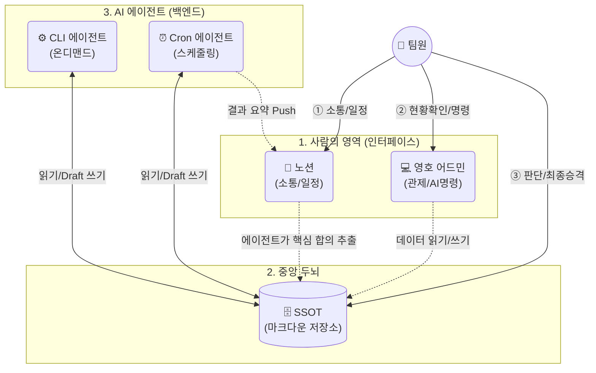

# 플랫폼 본부 두뇌 설계서

**버전:** v6.0 Final 
**작성일:** 2026.03.06
**작성:** CH / 각종 LLM 공동 설계
**상태:** 승인 대기

---

## 1. 목적: 왜 이 시스템을 만드는가

### 현재 상황

플랫폼전략본부는 4명이다. 그런데 동시에 돌아가는 프로젝트가 5개다: IBKR 해외주식 런칭, 트레이딩뷰/BP 연동, 국내 투자자 API 유입, Fi앱 개선, AX(리테일본부 자동화). 각각이 계약, 규제, 기술, 대외 소통, 내부 정치를 동시에 요구한다. 이 모든 판단이 CH에게 수렴한다.

여기에 더해, 플랫폼전략본부의 전략 방향성 자체를 설정하는 일이 있다. "해외주식 서비스를 어떤 포지션으로 가져갈 것인가", "다올 내에서 플랫폼전략본부의 역할과 확장 경로는 무엇인가", "AX를 어떤 순서와 논리로 타 본부에 확산할 것인가" — 이런 질문에 답하려면 경쟁사 분석, 시장 구조, 규제 동향, 내부 정치 역학을 교차하는 심층 리서치가 필요하다. 그런데 두 가지가 동시에 막혀 있다.

**첫째, 심층 리서치를 할 시간 블록이 없다.** 5개 프로젝트의 일상 운영 — 메일 회신, 이슈 대응, 소통 조율, 대행사 관리 — 이 매일 밀려온다. "긴급하진 않지만 중요한 일"인 전략 리서치는 계속 뒤로 밀린다. 피터 드러커가 말한 "경영자의 시간은 다른 사람의 것"이 정확히 이 상황이다. **더욱이 조만간 BAT와의 마케팅 실행이 본격화되면 다중 처리 부하는 지금의 2배 이상으로 뛸 것이다. 이 시스템은 그 폭발하는 병목을 견뎌내기 위한 사전 방어막이다.** "운영 부하를 줄여서 전략적 사고에 쓸 시간을 확보하지 않으면, 전략 방향성은 영원히 "다음에 하자"로 남는다.

**둘째, 겨우 시간을 내서 리서치를 해도 맥락이 휘발된다.** 과거에 분석했던 근거와 결론이 세션에만 남아 있으니, 매번 제로에서 다시 쌓아야 한다. 전략 방향성 설정이 "한 번 정하면 끝"이 아니라 시장과 규제가 바뀔 때마다 재검토가 필요한 일인데, 그 재검토의 출발점이 매번 백지다.

### 근본 원인: 노션에 대부분 있는데 AI가 제대로 못 읽는다

우리 팀은 이미 노션에 프로젝트 관리, 계약 구조, 금감원 대관 이력, IBKR 소통 내역을 쌓아두고 있다. 문제는 AI가 이걸 제대로 활용하지 못한다는 것이다.
노션 MCP(RAG)로 ECACA 계약 조항을 검색하면, 관련 청크를 못 찾거나 엉뚱한 부분을 가져온다. 결국 여러 페이지를 직접 하나씩 fetch해서 수동으로 대조해야 정확한 근거가 나온다. 오늘 microcap 분석에서도 6개 조항을 찾기 위해 노션 페이지 4개를 직접 열어봐야 했다.

노션은 "사람이 읽는 문서"로 설계되어 있지, "AI가 검색·추론하는 지식베이스"로 설계되어 있지 않다. 페이지 안에 자유 텍스트가 섞이고, 구조가 느슨하고, 검색이 부정확하다. MCP RAG는 그 위에 얹은 검색일 뿐이라 구조적 한계가 있다.

이 시스템은 그 문제를 푼다. **`AI가 정확하게 읽고 추론할 수 있는 구조화된 저장소(SSOT)를 만들고, 노션은 사람 간 소통용으로만 남긴다.`**

### 오늘 실제로 일어난 일

2026년 3월 5일. 이 날 하루에 동시에 처리해야 했던 일:

- IBKR이 DAOL을 "Execution-Only"로 분류 → Microcap 거래 제한 이슈 대응 (아래 상세)
- BAT(마케팅 대행사)에서 올라온 마케팅안 검토 및 대안 협의
- 회장단에서 플랫폼전략본부에 서버 엔지니어 인사 배치 요청 → 팀 구성 영향 검토

이 세 가지가 같은 날 같은 사람에게 동시에 온다. 규제, 마케팅, 내부 정치가 한 명의 판단 큐에 쌓이는 것이 이 팀의 현실이다.

그중 IBKR microcap 이슈를 풀기 위해 CH가 한 일:

1. IBKR 3/2 회신 메일 내용 확인
2. 노션에서 ECACA 계약 구조 페이지 검색 → 여러 페이지를 오가며 관련 조항 수집
3. ECACA Preamble, §4A, Addendum 1 §7.A, §3-L 조항을 하나씩 대조
4. "Product Scope ≠ Clearing Relationship" 논거 구성
5. IBKR 자체 정책 정의와 DAOL 구조 비교
6. 내부 검토서 작성 + IBKR 질의서 초안 작성
7. 질의서 톤·순서 조정 + 팀 소통 전략(지연→PM 채널, CH→Stacy 채널) 설계

소요 시간: 약 3시간. 그중 조항 찾기와 맥락 파악에 상당 시간, 실제 판단과 문서 작성에 나머지.

### 만약 이 시스템이 있었다면

**① IBKR microcap 이슈 (3시간 → 50분)**

1. CH가 Claude CLI를 열면 프로젝트별 분산 컨텍스트(`/projects/IBKR/.context.md`)에서 "IBKR = Clearing Broker, ECACA §7.A, 현재 이슈 목록"만 빠르고 정확하게 로딩 (0분)
2. 계약관(AI 에이전트)이 `IntentGate`를 통해 ECACA 관련 조항만 매핑해 놓음 (0분)
3. 소통관이 `cron` 스크립트를 통해 IBKR 3/2 회신을 자동 분류하고 Issue 초안 생성해 놓음 (0분)
4. CH는 매핑된 조항을 검토하고 "Product Scope ≠ Clearing Relationship" 논거를 판단 (30분)
5. 계약관이 분석 초안 + 질의서 초안 생성 (CH 검토 15분)
6. 소통관이 과거 Stacy/Prajakta 소통 이력을 요약해 놓아서, 발송 채널 판단 즉시 가능 (5분)

**② BAT 마케팅안 검토 (1시간 → 10분)**
실제로 일어난 일: BAT가 상세 예산안(엑셀)과 운영 스케줄을 보내왔다. 이전 소통 맥락(사전예약→CBT 2단계 실험, 산출물 기대치, MMP 제약사항 등)을 머릿속에서 재구성하면서 예산안을 검토해야 했다. 결론은 "금액도 기간도 스케일업 필요"였는데, 메일 쓸 시간이 없어서 바로 전화로 피드백. 별도로 영호에게 MMP 현황을 BAT에 보내달라고 구두 요청.

시스템이 있었다면:

1. 소통관이 BAT 메일 수신 즉시 분류 + 첨부 엑셀 요약 + Issue 초안 생성 (0분)
2. DEC-MKT-PLAN(채널/예산/메시지 방향)이 canonical에 존재 → 소통관이 BAT 제안을 기존 방향과 자동 대조: "제안 예산 규모가 확정 방향 대비 과소", "스케줄이 사전예약 일정과 미스매치" 플래그
3. 과거 BAT 소통 이력(미팅 후 정리, CH 회신, 영호 MMP 공유 등)이 스레드로 정리되어 있어 맥락 재구성 불필요 (0분)
4. CH는 플래그된 갭만 확인하고 "스케일업 필요" 판단 (5분)
5. 소통관이 판단을 반영한 회신 초안 자동 생성 + 영호에게 "MMP 현황 BAT에 공유 필요" 액션 아이템 자동 등록 → 전화 대신 메일로 깔끔하게 처리 (5분)

**③ 인사 배치 요청 검토 (맥락 파악만 1시간+ → 15분)**

1. CONTEXT.md에 팀 구성(4명 역할/중첩/현재 부하)이 정리되어 있음 (0분)
2. 정보관이 현재 5개 프로젝트별 기술 인력 부하를 요약해 놓음 (0분)
3. CH는 "서버 엔지니어 추가 시 팀 구조 변화"를 기존 데이터 위에서 바로 판단 — 병초와의 역할 중첩, 프로젝트 배분, 보고라인 영향을 SSOT 참조하며 검토 (15분)
4. 필요하면 Decision 초안을 만들어 근거와 함께 기록 → 나중에 경영진 보고 시 재활용

소요 시간 합계: 약 1시간 15분. 현재는 이 세 가지만으로 하루가 끝난다. 시스템이 있으면 오후에 전략 리서치를 할 시간이 생긴다.

### 이 시스템의 본질과 성공기준

4명이 40명의 아웃풋을 내는 구조. AI 에이전트가 조항 찾기, 메일/슬랙 분류, 브리핑 생성, 외부 동향 모니터링, 카피 규제 필터링, 자동화 후보 발굴을 상시 수행한다. 

사람은 "판단"과 "확정"에만 집중한다.

팀원 각자의 머릿속에만 있던 지식이 시스템에 축적된다. 

계약 해석, 규제 논거, 마케팅 방향, 주문유형 스코프, 기술 설계 이유, 소통 맥락이 SSOT에 남아 있어 팀원 누군가가 부재해도 팀이 멈추지 않는다.

"왜 이 결론이야?"를 다시 설명하지 않는다. 

예산 근거, 메시지 선택 이유, R&R 합의, 규제 포지션 — 한번 Decision으로 확정하면 재논쟁이 사라진다. 새 정보가 나와서 재검토가 필요하면 기존 DEC 위에서 시작한다.

플랫폼전략본부가 다올의 AI 전환(AX) 엔진이 된다. 이 시스템 자체가 "4명 팀이 AI로 5개 프로젝트를 동시에 돌리는 실증 사례"이며, 이를 리테일본부·IB본부에 이식하면 플랫폼전략본부의 역할과 예산이 확장된다.

**`나아가 이 프로젝트가 실패하더라도 시도한 것 만으로 우리 팀원 각자의 자산이 된다 ← 이건 명확하다`**

**성공 기준:**

- "오늘 뭐가 제일 위험하지?"에 팀 전원이 같은 답을 말한다.
- 팀원의 분석 시간이 절반 이하로 줄어든다.
- 새 이슈(규제든 마케팅이든 기술이든)가 터져도 과거 논거를 1분 내 찾을 수 있다.
- 대행사/IBKR에 "전에 뭐라고 했는지" 뒤지는 시간이 0이 된다.

---

## 2. 이렇게 달라진다

**아래는 실제로 CH가 AI와 가장 많은 시간·토큰을 소모한 업무 유형별로, 이 시스템 도입 전후가 어떻게 달라지는지를 보여준다.**

### 시나리오별 효과

**시나리오 1: 계약/정책 해석 + 전제 반박 (C3)***실제 사례: IBKR microcap Execution-Only 분류 반박 (2026.03.05)*

| 현재 | 시스템 도입 후 |
| --- | --- |
| ECACA 조항 6개를 노션/PDF에서 하나씩 찾음 (2시간) | 계약관이 조항 매핑 완료 상태. CONTEXT에서 즉시 로딩 (0분) |
| "Product Scope ≠ Clearing Relationship" 논거를 처음부터 구성 | DEC-2026-0001이 이미 존재. 기존 논거 위에서 확장 |
| 질의서 톤·순서 조정 (1시간) | 소통관이 과거 Stacy 소통 톤 참조해서 초안 생성 |
| **CH 3시간** | **CH 50분 (판단·확정만)** |

**시나리오 2: 금감원 대관 Q&A/경과보고 (C4)***실제 사례: 데이터보호 소명 (2025.08~09), 종합경과보고 (2026.03.03)*

| 현재 | 시스템 도입 후 |
| --- | --- |
| 과거 제출자료 5종을 PDF/메일/노션에서 재수집 (반나절) | ART-FSS-TIMELINE + ART-FSS-QA가 canonical에 존재. 1분 내 참조 |
| "그때 뭐라고 했는지" 일관성 수동 체크 | 계약관이 기존 DEC-FSS-POSITION과 모순 체크 후 초안 생성 |
| 담당자 바뀌면 "전체 맥락 0→1" 재설명 | CONTEXT + Decision 로그로 30분 자습 가능 |
| **CH 2~3일** | **CH 반나절** |

**시나리오 3: 마케팅 전략/플랜/예산/채널/KPI (C1)***실제 사례: IBKR 마케팅 리서치→플랜→의사결정 매트릭스→카피 패키지*

| 현재 | 시스템 도입 후 |
| --- | --- |
| 예산·채널·메시지 근거를 매번 재설명 ("왜 이 예산?") | DEC-MKT-PLAN(채널/예산 확정)이 canonical에 존재. 근거 링크로 1분 점프 |
| 버전이 바뀔 때마다 연쇄 수정 (카피→고지→랜딩) | DEC 하나 갱신하면 연결된 Artifact가 자동 재검토 대상으로 플래그 |
| 대행사에서 "이건 R&R 아닌데요?" → 과거 합의 다시 찾기 | 소통관이 과거 DEC(R&R 확정건) 즉시 참조 → 회신 초안 자동 생성 |
| **CH+영호 수일** | **CH 승격만, 영호 카피 실행** |

**시나리오 4: 주문유형 범위/효과 + 메시지 연결 (C2)***실제 사례: Phase 1(5종)/Phase 2(26종) 주문유형 정의 → 타깃별 효과 → 마케팅 메시지*

| 현재 | 시스템 도입 후 |
| --- | --- |
| "주문유형→고객 가치→메시지→규제 표현" 연결고리가 길어서 매번 재구성 | DEC-ORDER-SCOPE(범위 정본) + ART-ORDER-DEMO(타깃별 효과) 존재 |
| IBKR 로직/제약 확인이 반복 | 병초의 기술 Decision에 제약사항 축적 → 재확인 불필요 |
| 규제 표현 가드레일을 매번 구두 확인 | DEC-MSG-GUARDRAIL(금지/허용 표현 정본) → 카피 생성 시 자동 참조 |
| **CH+병초+영호 각각 반복** | **각자 Decision 참조 → 중복 논의 제거** |

**시나리오 5: 브랜딩/고지/오인방지 설계 (C6)***실제 사례: 코브랜딩 문구/가드레일, 고지 위치, 랜딩 구조, 카피 패키지*

| 현재 | 시스템 도입 후 |
| --- | --- |
| 문장 하나가 여러 문서에 파급 → 연쇄 수정 | DEC-BRAND-GUARDRAIL(금지표현/허용표현) 1곳만 갱신 |
| "최종 문구가 뭐였지" 반복 | 최신 카피팩이 ART-COPY-PACK.latest로 포인터 관리 |
| 준법 코멘트가 메일/채팅에 흩어짐 | ISS로 등록 → 해결 이력 축적 |

**시나리오 6: 기술 통합 문서 (C7)***실제 사례: 연동/인증/원장/SSO/전자서명/인프라 관련 분석*

| 현재 | 시스템 도입 후 |
| --- | --- |
| 병초가 디버깅 → 해결 → 기록 안 남음 → 비슷한 장애 재발 시 처음부터 | DEC-TECH에 설계 결정 이유 + ART에 에러 패턴/해결 이력 축적 |
| "이 API 왜 이렇게 만들었지?" → 병초한테 물어봐야 함 | Decision 로그에 근거 존재 → 누구나 참조 가능 |
| CH가 기술 이슈 맥락 파악에 시간 소모 | CONTEXT + 기술 Decision이 있으니 CH가 미리 읽고 판단 지점만 확인 |

**시나리오 7: 대외 소통 — IBKR/대행사/BP/코스콤 (C8)***실제 사례: IBKR 스레드 관리, 대행사 질의 대응, BP 협의*

| 현재 | 시스템 도입 후 |
| --- | --- |
| "상대가 뭘 말했는지" 메일 뒤지기 반복 | 소통관이 스레드 요약 + 맥락 정리 자동 |
| 질문이 모호해서 재질문 발생 | 계약관/소통관이 "Yes/No로 답 가능한 질문 5개" 형태로 초안 |
| CH가 모든 메일 초안을 직접 작성 | 소통관 초안 → 지연 검토 → 발송. CH는 P0만 개입 |

**시나리오 8: 프로젝트 맥락 통합 (C5)***실제 사례: 새 세션/새 쓰레드마다 "전체 맥락 한 방 문서" 재작성*

| 현재 | 시스템 도입 후 |
| --- | --- |
| 새 세션에서 컨텍스트 재주입에 30분+ | 분산 컨텍스트(`.context.md`) 자동 로딩 → 0분 |
| 분산된 문서를 모아서 "한 방 정리" 매번 반복 | 운영관이 매주 "이번 주 변경사항" 자동 집계 → CONTEXT 갱신 제안 |

**시나리오 9: AX(리테일 자동화) 후보 발굴 + ROI (C9)***실제 사례: 리테일본부 업무 자동화 후보 조사, 경영진 설득 등*

| 현재 | 시스템 도입 후 |
| --- | --- |
| 업무 목록/시간/빈도 데이터가 흩어져 ROI가 매번 추정 | AX정찰관이 후보 리스트 + ROI 추정 축적 → 데이터 기반 판단 |
| "성공사례"가 구두 전달 → 확산 멈춤 | 성공사례가 ART로 축적 → 경영진 보고에 바로 활용 |
| 이 시스템 자체가 "4명이 5개 프로젝트를 AI로 돌리는" AX 실증 사례 | 리테일본부/IB본부 이식 시 설계서+산출물 그대로 재활용 |

### 종합: 카테고리별 효과

| 카테고리 | Canonical에 쌓여야 하는 최소 세트 | 효과 메커니즘 |
| --- | --- | --- |
| C1 마케팅 | DEC-MKT(채널/예산/메시지 확정), ART(플랜/매트릭스) | "왜 이 결론?"이 Decision에 고정 → 매번 설득문 재작성 제거 |
| C2 주문유형 | DEC-ORDER-SCOPE, ART-DEMO, DEC-MSG-GUARDRAIL | 제품 스펙 정본화 → 마케팅/고지/세일즈 문구 자동 정렬 |
| C3 계약/정책 | ART(조항 매핑표), DEC(전제 반박 판례) | "전에 뭐였지"가 0 → 재해석이 축적될수록 빨라짐 |
| C4 금감원 | ART(타임라인/QA), DEC(포지션 확정) | 일관성 체크 비용 급감 + 담당자 교체 리스크 감소 |
| C5 맥락 통합 | [CONTEXT.md](http://context.md/) + 주간 승격된 DEC/ART | 새 세션마다 컨텍스트 재주입 사라짐 |
| C6 브랜딩/고지 | DEC(금지/허용 표현), ART(카피팩) | 문장 1개의 연쇄 수정이 줄어듦 |
| C7 기술 | DEC(설계 이유), ART(에러 패턴) | 같은 장애/삽질 반복이 눈에 띄게 줄어듦 |
| C8 대외 소통 | ISS(회신 필요), DEC(채널/톤 원칙) | 회신 속도↑, 재질문↓, CH 개입 지점이 뒤로 밀림 |
| C9 AX/ROI | ISS(후보), ART(ROI), DEC(확산 전략) | 성과 근거 축적 → 내부 정치/설득 비용 급감 |

**`핵심: 개인의 작업이 팀의 자산이 된다. 사람이 바뀌어도 지식은 남는다. 축적될수록 팀은 빨라진다.`**

---

## 3. 핵심 메커니즘: 지식 축적 플라이휠

**이 시스템의 본질은 "개인의 리서치가 팀의 지식이 되는 루프(Flywheel)"를 만드는 것이다. 특히 토큰 낭비와 환각, 파일 동기화 충돌을 막는 것이 핵심이다.**

- **[플라이휠 작동 5단계]**
    1. **리서치 시작:** 팀원이 특정 프로젝트 폴더(예: `/projects/IBKR/`)에서 Claude CLI를 실행.
    2. **분산 컨텍스트 로딩:** 전체 데이터가 아닌 해당 프로젝트의 `.context.md`와 기존 Decision만 타겟 로딩하여 토큰 낭비를 막는다.
    3. **의도 게이트 (IntentGate):** 에이전트가 질문 의도를 파악해, 필요한 경우에만 특정 MCP(예: 금감원 문서 검색)를 일시적으로 켜서 작업을 수행한다.
    4. **결론 저장 ("저장해"):** 분석이 끝나고 팀원이 "저장해" 한 마디를 입력하면, 시스템이 템플릿에 맞춰 `/draft/` 에 자동 생성한다.
    *(※ **해시 기반 편집:** 기존 파일 수정 시 라인별 해시값을 검증하여 동시 편집 충돌을 기계적으로 방어한다.)*
    5. **승격 및 재사용:** 사람이 검토 후 `/canonical/`로 승격(확정)시키면, 이는 다음 리서치의 시작점(컨텍스트)이 된다.

**CH가 오늘 분석한 계약 해석이 내일 병초의 기술 판단에서 참조되고, 그 판단이 다음 주 영호의 카피에 반영된다. 분석 결과가 세션 종료와 함께 휘발되지 않고 팀의 영구적인 지식으로 쌓인다.**

---

## 4. 팀원 행동 지침: 이렇게 쓰면 된다

**시스템(CLI)은 복잡하지만, 팀원이 실제로 해야 할 행동은 단 하나, "저장해"뿐이다.**

### 4.1 "Claude가 알아서 기억하는데, 왜 '저장해'를 해야 해?"

가장 먼저 드는 의문일 것이다. 답은 명확하다. **내 컴퓨터의 Claude는 다른 팀원의 Claude와 기억을 공유하지 않는다.**

|  | Claude 자동 기억 | SSOT "저장해" |
| --- | --- | --- |
| **뭘 기억하나** | "병초는 지금 FIX 연동 작업 중" (단기 맥락) | "Tag58 한글 불가. 원인: IBKR 엔진 한계" (최종 결론) |
| **누가 보나** | 나의 Claude만 | **팀 전원** |
| **비유** | 내 머릿속 메모 | 팀 공유 드라이브에 공식 문서 올리기 |

CH가 3시간 분석해서 좋은 결론을 냈어도, "저장해"를 안 하면 CH의 Claude만 기억한다. 

다음에 다른 사람이 비슷한 이슈를 만나면 처음부터 다시 분석해야 한다.

### 4.2 언제 저장해야 하는가? (기준)

모든 브레인스토밍과 틀린 가설을 다 저장할 필요는 없다. 기준은 단순하다.

- "이 결론을 다른 팀원도 알아야 하나?" → **Yes면 "저장해"**
- "다음에 누군가 비슷한 이슈를 만났을 때 도움이 되나?" → **Yes면 "저장해"***(※ 파일 포맷, 마크다운 문법, 파일명, 폴더 위치는 Claude가 알아서 다 해준다.)*

### 4.3 "나는 노션에서 일하는데, SSOT에 또 저장해야 해?"

아니다. 노션에서 일어나는 일 중 SSOT에 와야 하는 건 오직 "핵심 결론과 합의"뿐이다. 일상 소통, 파일 공유, 일정 조율은 노션에 그대로 두면 된다.

- **자동 수집:** 노션 이슈 상태 변경 등은 운영관(에이전트)이 알아서 스캔하여 아침 브리핑에 올린다.
- **수동 저장 (10초):** 노션 TF 토론에서 중요한 합의가 나왔다면, 다음 CLI 세션에서 "노션 IBKR 페이지에서 어제 합의한 내용 SSOT에 저장해"라고 지시만 하면 된다.

**`핵심: 노션은 "일이 일어나는 곳(소통)"이고, 영호 어드민과 SSOT는 "결론이 쌓이고 굴러가는 곳(엔진)"이다.`**

---

## 5. 설계 원칙

| # | 원칙 |
| --- | --- |
| 1 | SSOT = AI가 읽고 쓸 수 있는 구조화된 저장소. 사람도 마크다운으로 읽고 쓴다 |
| 2 | 노션 = 소통, 일정, 파일 공유, TF 협업. 그 이상 아님 |
| 3 | AI 에이전트 = 팀원. 5개 역할 (정보관, 계약관, 소통관, 운영관, AX정찰관) |
| 4 | 산출물 4유형 표준화: Issue 초안, Decision 초안, Artifact 초안, Queue 업데이트 |
| 5 | Draft → Canonical 승격 체계. AI는 초안만, 사람이 확정 |
| 6 | 근거 링크 2개 이상 강제 (source_url + source_id) |
| 7 | 단일 큐 3개: Needs Reply, Due Soon (72h), P0 Issues |
| 8 | 운영 리듬: 매일 10분(큐 정리) + 주간 30분(승격·CONTEXT 갱신·P0 확정) |
| 9 | **CLI + Cron 자동화:** 백그라운드 태스크는 GUI 대신 쉘 스크립트 기반 구동 | |
| 10 | **영호 어드민 (Custom UI):** 맥락 파악(요약/번역)과 실행(초안 생성)이 직결된 인터널 웹 앱. 다올 내 AX 확산의 핵심 쇼케이스**`(옵시디언도 고려해볼만함)`** |
| 11 | **해시 기반 편집:** 파일 동시성 충돌 방지를 위한 기계적 방어막. | |

---

## 6. 시스템 구조



### 각 레이어의 역할(중요)

**[1] 사람의 영역 (인터페이스)**

- 🗣️ **노션:** 팀원 간 토론, 일정 조율, 대행사 파일 공유
- 💻 **영호 어드민:** 에이전트 현황 관제, 메일 요약/번역 확인, AI 액션 명령
- 🧠 **SSOT 직접 접근:** 최종 의사결정(Decision) 확정 및 Canonical 승격

**[2] 중앙 두뇌 (데이터 베이스)**

- 🗄️ **SSOT:** 모든 과거 맥락, 계약 조항, 규칙이 쌓이는 마크다운 저장소

**[3] AI 에이전트의 영역 (백엔드 엔진)**

- ⚙️ **CLI 에이전트:** 명령을 받으면 SSOT를 읽고 `/draft/`에 초안 작성
- ⏰ **Cron 에이전트:** 정해진 시간에 SSOT를 읽고 쓰며, 결과 요약본만 노션에 Push
- **CLI 에이전트 서버:** 사무실 내 공용 머신에서 `cron`과 쉘 스크립트로 동작하는 Claude Code 엔진.

---

## 7. 팀 구성: 사람 4명 + AI 에이전트 5명

### 7.1 팀원 역할 및 활용

### CH 역할 상세

CH는 플랫폼전략본부의 두뇌다. 전략 방향 설정, 계약·규제 최종 판단, 대외 핵심 소통, 본부 포지셔닝을 담당한다.

1. 전략·의사결정: 5개 프로젝트 방향 설정, 다올 내 포지셔닝.
2. 계약·규제: ECACA 등 해석, 금감원 대관 대응, 신규 서비스 법적 리스크 판단.
3. 대외 핵심 소통: Stacy(IBKR) 직접 소통, 경영진 보고.
4. AI·기술 전략: 중앙 두뇌 시스템 아키텍트.
5. 마케팅 방향: 플랜/예산/가드레일 확정(DEC-MKT). 실행은 영호가 담당.
*CH의 판단 속도가 올라가는 구조:* 계약관이 조항 매핑 + 분석 초안을 미리 만들어두면 CH는 "읽고 판단만" 한다. 3시간 분석이 1시간으로 줄어든다.

**CH의 지식이 축적되면:**

| 업무 | 축적되는 지식 | 활용 |
| --- | --- | --- |
| 계약 해석 | ECACA 조항별 해석, 적용 사례, IBKR 측 반응 | 새 이슈에 과거 해석 즉시 적용. 일관된 포지션 유지 |
| 규제 대응 | 금감원 Q&A 이력, FSS 관심사항, 제출 논거 | "전에 뭐라고 했는지" 즉시 확인 |
| 전략 판단 | 의사결정 근거, 검토한 대안, 기각 사유 | 과거 결정 참조. 신규 팀원 온보딩 |
| IBKR 소통 | Stacy/Compliance 협상 이력, 상대 입장 변화 | 에스컬레이션 전략, 톤·타이밍 판단 |

### 지연 역할 상세

지연은 플랫폼전략본부의 실행 허브다.

1. IBKR 프로젝트 전체 PM: 일정 관리, TF 조율.
2. 대외 소통 허브: IBKR 실무 소통. 스레드 관리 및 미회신 추적.
3. 부서 예산·행정 관리.
4. 정보 관리·문서화: 메일 파이프라인 운영, 회의록.
5. QA 운영 + UX 피드백: IBKR 화면 테스트(Owner), 병초와 기술 일정 조율.
*지연이 부재 시 테스트:* SSOT에 축적된 소통 이력 + 큐만 보고 다른 팀원이 긴급 대응 가능한지가 성공 척도다.

**지연의 지식이 축적되면:**

| 업무 | 축적되는 지식 | 활용 |
| --- | --- | --- |
| IBKR 메일 소통 | 스레드별 맥락 요약, 상대방 입장 변화 | 새 이슈 대응 시 과거 맥락 즉시 참조 |
| 마일스톤 관리 | 일정 변경 이력, 지연 원인, 의존관계 | 런칭 리스크 예측, 경영진 보고 |
| TF 조율 | 타팀 담당자·입장·병목 기록 | "누구에게 물어봐야 하는지" 즉시 파악 |
| QA 운영 | 테스트 라운드 이력, 버그 패턴, Go/No-Go 근거 | 동일 결함 재발 방지. 런칭 판단 근거 |

### 병초 역할 상세

병초는 플랫폼전략본부의 기술 엔진이다.

1. IBKR 서버/API 연동: 코스콤 FIX망 연동.
2. 트레이딩뷰/BP 연동.
3. 원장 시스템 정합성.
4. 인프라/보안.
*병초에게 시스템이 주는 가치:* 과거 분석·결정이 SSOT에 축적되어 CH가 미리 읽고 질문하므로 소통 비용이 줄어든다. 동일한 디버깅 삽질을 막아준다.

**병초의 지식이 축적되면:**

| 업무 | 축적되는 지식 | 활용 |
| --- | --- | --- |
| API 연동 | 연동 스펙, 에러 패턴, IBKR API 제약사항 | 과거 사례 즉시 참조. 디버깅 시간 단축 |
| 원장 설계 | 설계 결정 근거, 대안 비교, 정합성 룰 | 트레이딩뷰 연동 시 기존 설계 위에서 확장 |
| FIX 연동 | 코스콤 FIX 프로토콜, 필드 매핑, 예외 케이스 | 신규 연동(BP 등) 시 같은 삽질 반복 방지 |
| 디버깅 | 문제 원인·해결 과정 기록 | "전에 이거였다" 즉시 파악 |

### 영호 역할 상세

영호는 플랫폼전략본부의 인터페이스 빌더다.

1. **인터널 어드민 개발:** 맥락 요약, 번역, 영수증 엑셀 변환 등 팀 실무에 최적화된 웹 앱 개발 (AX 확산 쇼케이스).
2. Fi앱 개선: UX 재설계.
3. AX 기획·개발: 리테일본부 자동화 도구.
4. AI 앱 메이킹.
5. 마케팅 랜딩/카피 실행: CH가 확정한 방향(DEC) 안에서 대행사 소통 및 에셋 제작/버전 관리.
*영호에게 시스템이 주는 가치:* 마케팅 카피의 규제 피드백을 AI가 1차로 걸러주어 법무팀과의 핑퐁이 줄어든다. 어드민 자체가 부서의 핵심 프로덕트가 된다.

**영호의 지식이 축적되면:**

| 업무 | 축적되는 지식 | 활용 |
| --- | --- | --- |
| 어드민 개발 | UI 설계 결정, 사용자 피드백, 사용 빈도 | v2/v3 개선 시 데이터 기반 판단 |
| 마케팅 카피 | 카피 버전 이력, 전환율 데이터, 대행사 피드백 | "왜 이 문구로 갔는지" 근거 추적 |
| AX 도구 | 자동화 전후 비교 데이터, 리테일본부 피드백 | 타 본부 확산 시 성공 사례 재사용 |
| AI 앱 PoC | 실험 결과, 성공/실패 패턴, 기술 제약 | 다음 PoC에서 같은 실수 방지 |

### 7.2 사람 팀원

| 이름 | 역할 | 핵심 업무 | AI가 덜어주는 것 |
| --- | --- | --- | --- |
| CH | 본부장 | 전략 판단, 계약 확정, 규제 포지션 확정, 대외 최종 소통, 마케팅 방향 | 조항 찾기, 분석 초안, 경쟁사 조사, 보고서 초안 |
| 지연 | PM | IBKR 전체 PM, 대외 소통 허브, 일정·예산 관리, TF 조율, QA 운영, UX 피드백 | 메일 분류, 회신 초안, 미회신 추적, 일정 알림, 브리핑 |
| 병초 | 서버 엔지니어 | API 연동, 원장, FIX, 코스콤, 트레이딩뷰 연동, TPM(기술 프로젝트 관리) | 기술 문서 초안, 스펙 비교, 에러 패턴 분석 |
| 영호 | 프론트/디자인 | **인터널 어드민 개발**, Fi앱 UX, AX 기획, 마케팅 랜딩/카피, AI 앱 메이킹 | 자동화 후보 발굴, 효과 측정, UI 리서치 |

### 7.3 업무 중첩 현실과 이 시스템의 해법

4명 팀에서 역할이 깔끔하게 나뉘는 건 불가능하다. 실제로 아래와 같이 겹친다:

| 중첩 영역 | 관여하는 사람 | 현재 문제 | 시스템 도입 후 |
| --- | --- | --- | --- |
| PM/프로젝트 관리 | CH + 지연 | CH가 전략 판단과 실행 관리를 동시에 하느라 병목 | 지연이 Issue/큐 운영 → CH는 Decision 승격만 |
| TPM/기술 프로젝트 | 병초 + 지연 | 기술 일정을 지연이 추적하는데 병초 머릿속 맥락을 물어봄 | 병초 기술 Decision이 축적 → 지연이 직접 참조 가능 |
| UI/UX | 영호 + 지연 | 영호가 만들고 지연이 피드백하는데 "왜 이렇게 만들었지" 근거가 없음 | UX Decision에 판단 근거 축적 → 재논쟁 감소 |
| 마케팅 전략/실행 | CH + 영호 | CH가 방향 잡고 영호가 실행하는데 "최종 메시지가 뭐야" 혼란 | DEC-MKT(CH 승격)이 정본 → 영호는 그 안에서 카피 실행 |
| 대외 소통 | CH + 지연 | 둘 다 IBKR과 소통하는데 "누가 뭘 말했는지" 교차 확인 필요 | 소통관이 스레드 통합 → Needs Reply 큐에서 오너 명확화 |
| 규제/준법 | CH + (전원) | 규제 이슈가 마케팅·기술·소통 전체에 파급 | DEC-REGULATORY가 정본 → 전원이 같은 가드레일 참조 |
| 대행사 관리 | CH + 영호 + 지연 | 대행사 R&R/산출물/피드백이 메일·채팅에 흩어짐 | ISS로 추적 + DEC(R&R 확정)으로 재논쟁 차단 |

이 시스템은 "겹침을 제거"하는 게 아니라 **"겹치는 영역에서 누가 Draft하고 누가 승격하는지"를 고정한다.**

구체적으로:

- **Draft는 누구나 만든다.** 중첩 영역에서 CH, 지연, 영호 누구나 초안을 쓸 수 있다.
- **Canonical은 승격 권한자만 확정한다.** 마케팅 방향은 CH가 DEC로 확정. 카피 실행은 영호가 ART로 확정. 기술 스펙은 병초가 ART로 확정. 한 명만 최종본을 찍으니까 "최종이 뭐야?"가 사라진다.
- **Decision이 재논쟁을 막는다.** "왜 이 예산이야?" "왜 이 문구야?" — DEC에 근거가 남아있으니 반복 논쟁이 사라진다.
- **단일 큐가 매일 10분에 정리한다.** 중첩 이슈는 큐에서 만나서 "오너? 기한? 액션?"을 정리한다.

### 7.4 AI 에이전트 (CLI & Cron 기반)

| 에이전트 | 트리거 방식 | 동적 MCP (IntentGate) | 핵심 역할 |
| --- | --- | --- | --- |
| **운영관** | `cron` (매일 07:00) | `mcp-notion` | 일일 브리핑 생성, 큐 상태 점검 |
| **소통관** | `cron` (매시간) | `mcp-slack`, `mcp-gmail` | 메일/슬랙 파싱, Issue 초안, Due Soon 등록 |
| **계약관** | 온디맨드 (CLI) | `mcp-legal-docs`, `mcp-fss` | 조항 매핑, 모순 체크, 분석 초안 생성 |
| **정보관** | `cron` (매일 08:00) | `mcp-web-search` | 커뮤니티 센티먼트 모니터링 → 인텔 브리핑 |
| **AX정찰관** | 온디맨드 (CLI) | 없음 | 리테일 업무 자동화 후보 리포트 (Phase 4) |

**추가 스킬: 카피라이터 (Copywriter) — 소통관에서 분리**
마케팅 카피 생성은 소통관과 분리한다. 기능→고객 가치→메시지→규제 표현의 변환은 고난도 추론이므로 전용 스킬이 필요하다.

- **입력:** DEC-ORDER-SCOPE, DEC-MKT-GUARDRAIL, ART-ORDER-DEMO
- **출력:** 카피 변형안 (Artifact 초안), 규제 필터링 결과
- **작동 방식 (2단계):** 1. 기능/효과를 "사실 문장"으로 변환. 2. 사실 문장을 규제 가드레일에 통과시키며 카피로 변환.

---

## 8. SSOT 구조 (분산 컨텍스트 반영)

전체 맥락을 한 번에 로딩하여 발생하는 토큰 낭비와 환각을 막기 위해, **본부가 추진 중인 5대 핵심 프로젝트별로 `.context.md`를 쪼개어 배치한다.**

```
SSOT/
├── .claude/
│   └── CLAUDE.md            ← 시스템 룰 (해시 편집 강제 등 자동 로딩)
├── /skills/                 ← 에이전트 Custom Skills
│   ├── operations-agent/
│   ├── communications-agent/
│   ├── legal-analyst-agent/
│   ├── intelligence-agent/
│   ├── copywriter/
│   └── quality-gate/
├── /projects/               ← 5대 핵심 프로젝트 (분산 컨텍스트)
│   ├── /IBKR_Launch/        ← [프로젝트 1] IBKR 해외주식 런칭
│   │   ├── .context.md      ← 해당 폴더 작업 시 이 맥락만 로딩
│   │   ├── /issues/
│   │   ├── /decisions/      ← (예: ECACA 계약 해석, 마케팅 가드레일)
│   │   └── /artifacts/
│   ├── /TradingView_BP/     ← [프로젝트 2] 트레이딩뷰 및 BP 연동
│   │   ├── .context.md
│   │   └── /decisions/      ← (예: 원장 동기화 및 API 설계 원칙)
│   ├── /Domestic_API/       ← [프로젝트 3] 국내 투자자 API 유입
│   │   └── .context.md
│   ├── /Fi_App_Revamp/      ← [프로젝트 4] 다올 Fi앱 코어 개선 및 UX
│   │   └── .context.md
│   └── /Retail_AX/          ← [프로젝트 5] 내부 AX 주도화 (리테일 자동화)
│       └── .context.md
├── /sources/                ← 원문 아카이브 (Read-only)
│   ├── /mail/
│   ├── /contracts/
│   ├── /regulatory/
│   └── /slack_dumps/        ← 대행사 채널 메시지 (Phase 3~)
├── /intelligence/           ← 정보관 수집물 (경쟁사, 커뮤니티 동향 등)
├── /agent-logs/             ← 에이전트 작업 로그 (감사 추적용)
├── /reference/              ← 조직도, 규정, 회사 정책
└── /templates/              ← 산출물 표준 포맷
```

### 8.1 Custom Skills로 에이전트 구현

Cowork/Claude Code에서 SSOT 폴더를 열면 관련 작업 시 해당 에이전트의 절차·규칙·템플릿이 자동 로딩된다.
*(예시: legal-analyst-agent/SKILL.md 구조 유지)*

### 8.2 ID 체계 및 Source ID 규칙

| 개체 | 형식 | 예시 |
| --- | --- | --- |
| 프로젝트 | PRJ-NNNN | PRJ-0001 (IBKR) |
| 의사결정 | DEC-YYYY-NNNN | DEC-2026-0001 |
| 메일 원본 | mail:<message-id> | [abc123@ibkr.com](mailto:abc123@ibkr.com) |
| 계약 조항 | contract:문서명_위치 | contract:ECACA_§7. |

---

## 9. 기술 제약 및 대응 (GUI 도구 한계 극복)

| 제약 (기존 GUI 도구) | v6.0 대응 (CLI  + 인터널 어드민) |
| --- | --- |
| 세션 간 메모리 없음 | 디렉토리별 `.context.md` 파일로 세션 시작 시 필요 맥락만 강제 로딩 |
| 스케줄 태스크 실행 불가 | 사무실 내 공용 머신(상시 가동) 지정 + OS `cron` 쉘 스크립트로 Claude CLI 무인 구동 |
| 공유 환경 동시성 충돌 | `.claude.md`에 **해시 기반 편집(Hash-Anchored Edits)** 룰 강제. 충돌 시 덮어쓰기 거부 |
| 토큰 낭비 및 환각 | `IntentGate`를 통해 필요한 MCP(예: 금감원 자료)만 동적 마운트 후 해제 |

---

## 10. 운영 규칙 (7개)

1. **승격 권한 (RACI):** Decision은 CH 단독, 기술 문서는 병초. AI는 오직 `/draft/`에만 쓰기 가능.
2. **원문 보존:** `/sources/` 파일은 절대 수정 불가(Read-only).
3. **근거 링크 강제:** 모든 산출물에 최소 2개의 근거(`source_id`) 강제. (외부 유입 메일 1건인 경우 제외)
4. **단일 큐 시스템:** Needs Reply (소통관 자동), Due Soon (기한 임박), P0 Issues.
5. **모순 감지:** 계약관이 기존 Decision(Canonical)과의 논리 충돌 여부를 RAG로 선행 검색.
6. **보안/민감 데이터:** 고객 정보/내부 시스템 IP 절대 포함 불가. 영호 어드민의 관리자 필터 기능으로 사전 차단.
7. **Canonical 덮어쓰기 금지 (Immutable 버전 + 포인터):** 반복 수정되는 마케팅 카피 등은 버전을 붙여 저장(`ART-2026-0015-v03.md`)하고, `.latest` 포인터로 최신본을 관리하여 과거 Decision의 참조 맥락을 보호한다.

---

## 11. 에이전트 협업 시퀀스

**예시 1: IBKR 새 정책 변경 메일 수신**

1. **소통관(Cron):** 메일 수신 감지 → 원문 저장 → Issue 초안 생성 → Needs Reply 큐 업데이트
2. **계약관(온디맨드):** 새 Issue에 대해 조항 매핑 → 모순 체크 → 분석 초안 생성
3. **운영관(Cron):** 아침 07:10 브리핑에 해당 건 반영 (긴급도 판단하여 P0 플래그)
4. **CH:** 어드민에서 브리핑 확인(10분) → 어드민 UI의 요약/번역 기능 활용 → Decision 확정 및 승격
5. **소통관(온디맨드):** CH가 어드민에서 '답장 초안 생성' 명령 시 즉각 초안 도출
6. **지연:** 초안 확인 후 최종 발송 (CH는 검토·승격에만 관여)

**예시 2: 대행사가 슬랙에서 산출물 기한 언급 (Phase 3~)**

1. **데이터 덤프:** `cron` 스크립트가 슬랙 `#daol-bat` 메시지를 `/sources/slack_dumps/`에 저장
2. **소통관(Cron):** 메시지 내 "금요일까지 소재 A안 전달" 감지
3. **큐 업데이트:** 소통관이 `Due Soon` 큐에 해당 일정 등록
4. **운영관(Cron):** 아침 브리핑에 `Due Soon` 항목으로 표시
5. **지연:** 어드민 큐에서 확인하고 금요일 미수신 시 대행사에 팔로업 (슬랙 스레드를 일일이 뒤질 필요 없음)

---

## 12. 영호 어드민 설계 (인터널 웹 앱 기반 AX 쇼케이스)

옵시디언과 같은 단순 텍스트 뷰어를 넘어, 현업의 Pain Point를 완벽히 해결하고 향후 전사 확산의 무기(Product)가 될 커스텀 웹 어드민을 구축

### 12.1 핵심 UI/UX 기능

- **단일 큐 관제탑:** Needs Reply, Due Soon, P0 이슈 현황을 한눈에 파악.
- **맥락 파악 사이드바:** IBKR의 복잡한 영문 메일 원본 옆에 **'AI 요약(3줄)'과 'AI 자동 번역(영→한)'**이 상시 배치되어 가독성 극대화.
- **Action UI (실행 엔진):** 화면 내 입력 조건창에 "정중하게 거절해줘" 등의 프롬프트 입력 시, 클릭 한 번으로 백엔드의 소통관(CLI)을 트리거하여 메일 답장 초안을 화면에 즉시 렌더링.
- **관리자 통제권 (Admin Control):** 수집할 이메일 도메인(`interactivebrokers.com` 등)과 화이트리스트/블랙리스트 태그를 UI에서 직접 제어. 불필요한 데이터 유입(가비지) 차단.
- **AX 확장 쇼케이스 (영수증 변환):** 영수증 이미지를 업로드하면 엑셀 파일로 자동 변환해 주는 시범 기능 탑재. 이는 향후 리테일본부 등 타 본부에 본 시스템을 이식(SaaS화)할 때 경영진을 설득할 결정적 기능.

---

## 13. 운영 리듬

- **매일 (10분):** 07:00 CLI/Cron 브리핑 자동 생성 → 07:30 CH 어드민 확인 및 큐 정리, Draft 승격
- **매주 금요일 (30분):** 17:00 주간 리뷰 자동 생성 → 17:30 CH Draft 일괄 승격, CONTEXT 갱신, 다음 주 P0 확정

---

## 14. KPI (2주 내 확인)

| 지표 | 측정 방법 | 목표 |
| --- | --- | --- |
| 회신 SLA | Needs Reply 큐 평균 체류 시간 | IBKR 48h 이내, 기타 72h 이내 |
| 검색 시간 | 특정 조항/근거 찾는 데 걸리는 시간 | 5분 → 1분 |
| 승격 수 | 주간 Canonical 등록 건수 | 주 5건 이상 |
| 브리핑 활용 | 브리핑 내 액션 아이템 완료율 | 70% 이상 |
| 파일 충돌률 | 해시 불일치로 인한 쓰기 거부 건수 | 시스템(OmO) 작동 확인 용도 |

---

## 15. 실패 방지 장치 (플라이휠 정지 방지)

이 시스템의 최대 리스크는 기술이 아니라 팀원의 입력 **습관**이다. 

리서치 후 "저장해"를 안 하면 시스템은 결국 "정리 잘 된 빈 폴더"로 끝난다.

- **장치 1: 마찰 최소화 (10초 완료):** CLI 또는 어드민 UI에서 "저장해" 명령어 하나면 템플릿 포맷, 해시 검증, 폴더 배치, 파일명 생성, source_id 부여가 전부 자동 처리된다.
- **장치 2: 리듬에 녹인다:** 브리핑에 "어제 /draft/ 저장 건수: N건"을 가시화하여 팀의 자발성 유도.
- **장치 3: CH가 솔선한다:** CH가 매번 분석 후 저장하여 "지난번 분석이 여기 있으니까 바로 이어서 하자"를 직접 체감시킨다.

---

## 16. 도입 계획 (마일스톤 4주 압축)

### Phase 1 (W1~W2): 코어 셋업 & 인터널 어드민 연동

- **W1:** SSOT 구조 생성, 프로젝트별 `.context.md` 분산 작성. `.claude.md`에 해시 기반 편집 룰 적용. 공용 머신 확보.
- **W1:** 영호 어드민 데모 버전과 백엔드 SSOT 데이터 기본 연동. 메일 수집 및 요약/번역 기능 우선 오픈.
- **W2:** CH 로컬 PC에서 계약관(CLI 온디맨드) 실행 테스트.
- **W2:** 공용 PC `cron` 셋업 → 일일 브리핑(운영관) 자동 생성 확인. 매일 10분 리듬 시작.

### Phase 2 (W3~W4): 소통관 (슬랙/메일) & 어드민 실사용

- **W3:** Slack API 데이터 덤프 쉘 스크립트 작성. 대행사 커뮤니케이션 룰 수립.
- **W3:** 소통관 스킬 적용 및 Due Soon 큐 파싱 정확도 튜닝. 영호 어드민 Action UI(초안 생성) 고도화.
- **W4:** 웹 스크래핑 연동 및 커뮤니티 센티먼트 수집(정보관).
- **W4:** 4인 팀 전원 어드민 실사용 숙달 및 파일 충돌 방어(해시) 기제 점검. 주간 리듬 시작.

### Phase 3 (W6~): AX 확산 쇼케이스 (영수증 변환 등)

- **W6:** 영호 어드민 v2 업데이트 (영수증 → 엑셀 변환 등 리테일 본부 시연용 자동화 툴 추가).
- **W6:** 에이전트 추가 검토 및 경영진 데모 시연 준비.

---

## 17. 열린 질문 (향후 결정)

1. **SSOT 물리적 위치:** 공유 드라이브 vs. 로컬 Git vs. 클라우드 (Supabase/Firebase 등). W1~W4는 단순 공유 폴더로 시작 후 충돌 빈도에 따라 전환.
2. **영호 어드민 기술 스택:** 최종 확정 (프론트/백엔드 연동 방식, API 처리 구조).
3. **~~확정 사항:** 팀 전원 Max 플랜 (회사 지원).~~
4. **노션 → 영호 어드민:** 완전 전환 시점 판단 기준.
5. **다올 타 본부 확산:** 구조 변경 범위.
6. **W8 이후 에이전트:** Skill → Plugin 구조 전환 검토 (명령어 표준화, 배포 용이성 증대).

Claude 작업 테스트

[기술 검토서 — 플랫폼 본부 두뇌 설계서 실현을 위한 기술적 타당성 분석](https://www.notion.so/31b83b647f9d81a880f9c523b27d50bc?pvs=21)

[커스텀 MCP 서버 개발 검토 — 두뇌 설계서를 위한 자체 MCP + Cowork 플러그인 전략](https://www.notion.so/MCP-MCP-Cowork-31b83b647f9d81abbe54ebd69f179a92?pvs=21)